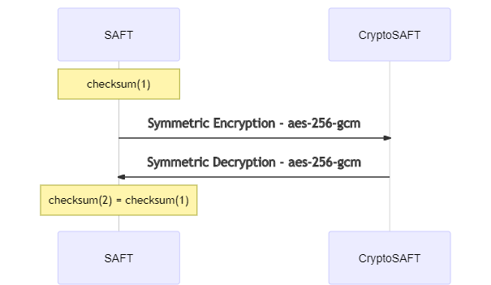

# Checksum

## Descrição

Ainda não é claro qual o [algoritmo](https://en.wikipedia.org/wiki/Category:Checksum_algorithms) a usar para se obter o checksum do ficheiro SAF-T \(PT\). O checksum permite validar se um ficheiro CryptoSAF-T após ser desencriptado é igual ao original \(não encriptado\).



## Exemplos

Bash \(Unix Shell\)

```bash
$ sha256sum saft.xml
8272604da8443bc3dfca6a5071d19e9c29b49dcee552d87f203c4ed74ff2b604  saft.txt
```

OpenSSL

```bash
$ openssl sha256 saft.xml
SHA256(saft.xml)= 8272604da8443bc3dfca6a5071d19e9c29b49dcee552d87f203c4ed74ff2b604
```

Windows PowerShell

```powershell
Get-FileHash .\saft.xml -Algorithm SHA256

Algorithm       Hash                                                                   Path
---------       ----                                                                   ----
SHA256          8272604DA8443BC3DFCA6A5071D19E9C29B49DCEE552D87F203C4ED74FF2B604       saft.xml
```

