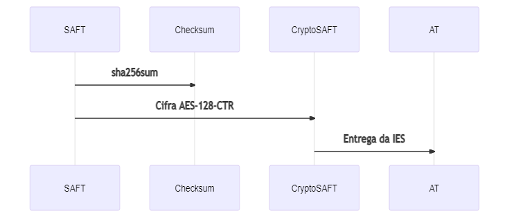

# Mecanismo de cifra

A encriptação dos [**elementos**](elementos.md) tem por base o algoritmo de cifra aes-128-ctr que retira partido do uso de uma **chave simétrica**. A par da encriptação existe também o desafio da obtenção do checksum do ficheiro SAF-T \(PT\) original.

## Parâmetros da cifra

**Algoritmo de Cifra**: Advanced Encryption Standard \(AES\) – FIPS 197  
**Modo de Operação**: Counter \(CTR\) – NIST Special Publication 800-38A  
**Chave De Cifra**: Aleatória de 128 bits  
**Vetor de Inicialização\(IV\)/Counter**: Aleatória de 128 bits

## CryptoSAF-T e IES/DA

### Descrição

O ERP de Contabilidade tem de criar **dois ficheiros**, o `SAF-T (PT)` para efeitos de entrega da IES/DA e o `CryptoSAF-T`. 

A chave simétrica é usada para encriptar os [**elementos**](elementos.md) \(clique para ver a lista de elementos abrangidos\), no que resultará o `CryptoSAF-T`. O regulamento indica que deve ser usado o algoritmo `aes-128-ctr` para encriptar cada um dos elementos em causa.

Com o [**checksum**](../saf-t-pt/checksum.md) do ficheiro `SAF-T (PT)` original e do `CryptoSAF-T` a aplicação está em condições de submeter a IES/DA. O envio da IES/DA é feito através do contabilista do Contribuinte no Portal das Finanças, onde tem de carregar o `CryptoSAF-T` e o `checksum` do `SAF-T (PT)`.

