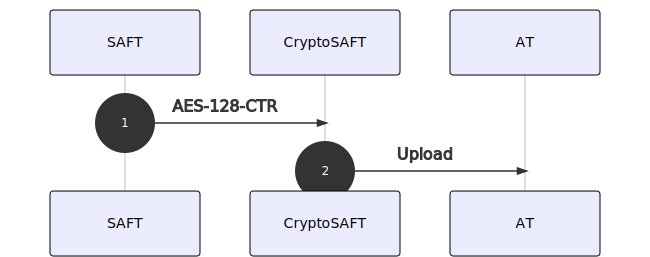

# Mecanismo de cifra

A encriptação dos [**elementos**](elementos.md) tem por base o algoritmo de cifra aes-128-ctr que retira partido do uso de uma **chave simétrica**.

## Parâmetros da cifra

**Algoritmo de Cifra**: Advanced Encryption Standard \(AES\) – FIPS 197  
**Modo de Operação**: Counter \(CTR\) – NIST Special Publication 800-38A  
**Chave De Cifra**: Aleatória de 128 bits  
**Vetor de Inicialização\(IV\)/Counter**: Aleatória de 128 bits

## CryptoSAF-T e IES/DA

### Descrição do processo

O ERP de Contabilidade tem de criar **dois ficheiros**: (1) o `SAF-T (PT)` de Contabilidade para efeitos de entrega da IES/DA e (2) o `CryptoSAF-T` a partir do ficheiro anterior.

O CryptoSAF-T tem por base a encriptação da lista de [**elementos**](elementos.md) referidos na legislação através do algoritmo de chave simétrica `aes-128-ctr`.


Para garantir a autenticidade do ficheiro original é necessário calcular o seu [**checksum**](../saf-t-pt/checksum.md). No entanto, o CryptoSAF-T **deve ser criado a partir do ficheiro original** e não a partir do ficheiro canonizado.




Uma vez concluídos todos estes procedimentos o utilizador estará em condições de submeter o ficheiro para efeitos do pré-preenchimento da IES/DA. O envio destes elementos é da competência exclusiva do contabilista da empresa.
