# Diagramas

Em baixo apresentam-se um conjunto de diagramas que permitem perceber cada uma das fases do processo, desde o pedido inicial da chave até à submissão da IES/DA.

## Fase 1 - Pedido de geração de chave

### Descrição

O início do processo tem origem na invocação de um `webservice` da INCM. Nesta fase é feito um pedido geração de chave simétrica e para o qual são requeridos os parâmetros `NIF` e `Ano` a que respeita a declaração da IES/DA. 

Este pedido carece de autenticação pelo Contribuinte. O Contribuinte será em seguida notificado através do serviço viaCTT por forma autenticar o pedido. 

## Fase 2 - Pedido de chave

### Descrição

A segunda fase do processo visa obter a chave simétrica para encriptação dos [**elementos**](elementos.md) do SAF-T \(PT\). Nesta fase, já na posse do código de autenticação, estabelece-se uma nova ligação com o `webservice` onde se inserem os parâmetros `NIF`, `Ano` a que respeita a declaração da IES/DA e `código` recebido através de viaCTT.

## Fase 3 - CryptoSAF-T e IES/DA

### Descrição

A aplicação tem de criar **dois ficheiros**, o `SAF-T (PT)` original, em que se chama especial atenção para as [**obrigações**](../obrigacoes.md#aspetos-chave-do-cryptosaf-t) e o ficheiro a que respeita o `CryptoSAF-T`.

A chave simétrica é usada para encriptar os [**elementos**](elementos.md) \(clique para ver a lista de elementos abrangidos\), no que resultará o `CryptoSAF-T`. O regulamento \(por confirmar\) indica que deve ser usado o algoritmo `aes-256-gcm` para encriptar cada um dos elementos em causa.

Após a obtenção do `checksum` do ficheiro `SAF-T (PT)` original e do `CryptoSAF-T` a aplicação está em condições de submeter a IES/DA. O envio da IES/DA é feito através do contabilista do Contribuinte no Portal das Finanças, ontem tem de carregar o `CryptoSAF-T` e o `checksum` do `SAF-T (PT)`.

## Fase 4 - Acesso pela AT ao ficheiro original

### Descrição

A Autoridade Tributária e Aduaneira mantém os ficheiros CryptoSAF-T em sua posse pelo período de 15 anos a contar da data da sua submissão. Esses ficheiros podem ser usados no âmbito de eventuais procedimentos inspetivos tal e qual como descrito no Artigo 6.º do [**Decreto-Lei Decreto-Lei n.º 48/2020 de 3 de agosto**](https://data.dre.pt/eli/dec-lei/48/2020/08/03/p/dre). Uma vez que a custódia das chaves compete à INCM, sempre que a AT necessitar de desencriptar um ficheiro CryptoSAF-T terá que invocar o `webservice`. Dessa ação resultará a informação ao Contribuinte de que a sua chave foi requerida pela AT, que lhe será comunicada através do serviço viaCTT. 

