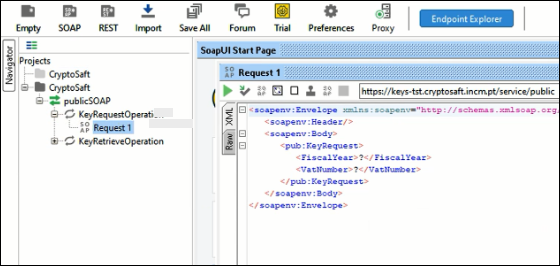

# Testar Webservice

Existem inúmeras ferramentas que possibilitam a integração com Webservices SOAP. A generalidade das tecnologias de desenvolvimento tem suporte de integração com webservices de forma nativa ou através de integração com outros serviços.

Estas são algumas das ferramentas disponíveis:

* [SoapUI \(windows, linux, mac\)](https://www.soapui.org/)
* [Microsoft Visual Studio](https://docs.microsoft.com/en-us/visualstudio/test/how-to-create-a-web-service-test?view=vs-2019#to-create-a-simple-web-service)
* [Postman](https://learning.postman.com/docs/sending-requests/supported-api-frameworks/making-soap-requests/)
* [Zeep: Python SOAP Client](https://docs.python-zeep.org/en/master/)
* [JAVA JAX-WS](https://javaee.github.io/metro-jax-ws/)
* [PHP](https://www.php.net/manual/en/book.soap.php)

## Testar com o SoapUI

Neste exemplo vamos demonstrar como realizar o teste com o webservice da INCM usando o SoapUI.


O SoapUI é uma ferramenta open source para testes de API. É uma ferramenta amplamente usada por _developers_, _testers_ e utilizadores finais, com suporte para a generalidade dos testes funcionais de Serviços Web SOAP e API REST. Para além dos testes funcionais o SoapUI também permite tarefas de análise, testes de segurança, de virtualização e de _mocking_.


### Criar Projeto SOAP a partir de um WSDL

1. No SoapUI crie um novo projeto através da menu **File &gt; New SOAP Project**

     

2. Dê um **Nome** ao projeto e coloque seguinte URL no campo Initial URL:

   ```text
    https://keys-tst.cryptosaft.incm.pt/service/public?wsdl
   ```

3. Pode deixar as restantes opções tal e qual como estão por defeito e clique em **OK**.

O SoapUI tratará de gerar o serviço e um conjunto de testes de simulação opcionais.

### Trabalhar com WSDL no SoapUI


WSDL ou _Web Service Description Language_ consiste numa linguagem baseada na definição de XML. É usada para descrever as funcionalidades do serviço SOAP podendo comparar-se com um schema de XML, embora para fins distintos. Os ficheiros WSDL são fundamentais para testar e usar corretamente webservices baseados em SOAP. Para saber mais pode visitar [**esta página**](https://www.w3.org/TR/2001/NOTE-wsdl-20010315).


Após a criação do projeto, as ligações do serviço serão carregadas no SoapUI.



### Operações

O serviço de WSDL apresenta duas operações, `KeyRequestOperation` e `KeyRetrieveOperation`. Ambas com suporte às funções de pedido e de resposta a mensagens.

### Pedidos

Os pedidos são apresentados sob a forma de nós das operações. No SoapUI podem ser adicionados quantos pedidos quantos os necessários, mas, por defeito são sempre criados pedidos de exemplo.

### KeyRequestOperation

Para realizar este pedido, preencha os valores correspondentes a `FiscalYear` e `VatNumber` e clique em .


A resposta a este pedido desencaderá o envio de uma mensagem para a caixa de correio [**viaCTT**](pedido-de-chave.md).

### KeyRetrieveOperation

O código `RetrieveCode` que permite invocar a operação `KeyRetrieveOperation` é enviado para a caixa de correio viaCTT do utilizador.

Para invocar o segundo pedido, preencha os valores `FiscalYear`, `VatNumber` e `RetrieveCode` e clique em .


A mensagem deste pedido contem os valores correspondentes à chave de cifra `Key` e o vetor de inicialização `IV` necessários para realizar o processo de cifra do ficheiro SAF-T \(PT\) da Contabilidade.

