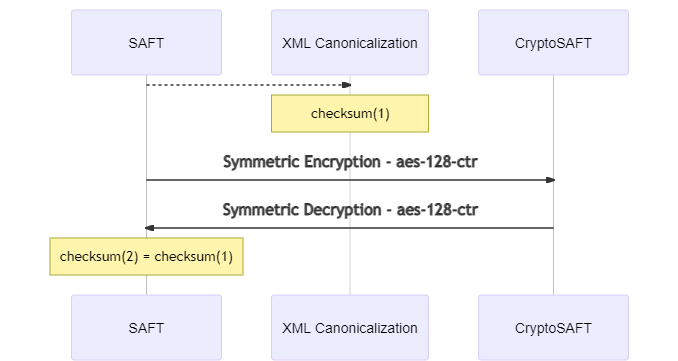

# Checksum

## Algoritmo

SHA-256

## Descrição

O algoritmo de checksum `SHA256` permite calcular e verificar o hash de um determinado ficheiro ou de um bloco de informação.  Neste caso, o checksum vai permitir validar se um ficheiro CryptoSAF-T após ser desencriptado é igual ao original \(não encriptado\).

## Remover do XML informação desnecessária

Para obter uma soma de verificação \([**checksum**](checksum.md)\) certa, após a desencriptação do CryptoSAF-T, no ficheiro SAF-T \(PT\) original é, em primeiro lugar, necessário retirar toda a informação desnecessária que possa estar a mais. Este procedimento é feito através do método Canonical XML \[[XML-C14N](https://www.w3.org/TR/xml-exc-c14n/#ref-XML-C14N)\].

## Algoritmo de canonização

* Canonização seguido de resumo \(checksum\)

### Canonização

* Canonical XML Version 1.1

### Parâmetros

* sem comentários e não-exclusivo

### Algumas ferramentas

* .NET [XmlDsigExcC14NTransform Class](https://docs.microsoft.com/en-us/dotnet/api/system.security.cryptography.xml.xmldsigexcc14ntransform?view=dotnet-plat-ext-3.1)
* Windows / Linux / Unix: [libxml2](https://www.aleksey.com/xmlsec/c14n.html)
* JAVA: [XOM](https://github.com/elharo/xom/), [Santuario Class Canonicalizer](http://santuario.apache.org/Java/api/org/apache/xml/security/c14n/Canonicalizer.html)


Consulte o repositório [**CryptoSAF-T: SAF-T Utils**](https://github.com/assoft-portugal/CryptoSAF-T-SAF-T-Utils) onde pode verificar e testar os métodos de canonização e encriptação do XML.


