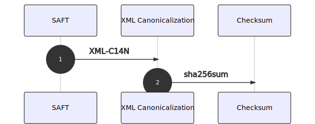

# Checksum

## Algoritmo

SHA-256

## Descrição

O algoritmo de checksum `SHA256` permite calcular o hash de um determinado ficheiro ou de um bloco de informação. Neste caso, o checksum é usado para validar que um ficheiro SAF-T \(PT\) é igual ao ficheiro original, após ter sido desencriptado.

## Canonização

O cálculo do [**checksum**](checksum.md) do ficheiro deve ser antecedido da sua canonização \(Canonical XML \[[XML-C14N](https://www.w3.org/TR/xml-exc-c14n/#ref-XML-C14N)\]\). Este é um processo que tem por objetivo remover a informação desnecessária e que possa estar a mais no `XML` e que vai garantir que o hash diz respeito exclusivamente ao conteúdo do ficheiro.


Este passo é particularmente importante na medida [**em que vai ser usado pela AT**](../incm/pedido-de-chave.md#fase-3---acesso-pela-at-ao-ficheiro-original) nos casos em que se proceda à desencriptação de ficheiros CryptoSAF-T que estejam em sua posse.


## Algoritmo de canonização

* Canonização seguido de resumo \(checksum\)

### Método

* [Canonical XML Version 1.1](https://www.w3.org/TR/xml-c14n11/)

### Parâmetros

* sem comentários e não-exclusivo

## Algumas ferramentas

* .NET [XmlDsigExcC14NTransform Class](https://docs.microsoft.com/en-us/dotnet/api/system.security.cryptography.xml.xmldsigexcc14ntransform?view=dotnet-plat-ext-3.1)
* Windows / Linux / Unix: [libxml2](https://www.aleksey.com/xmlsec/c14n.html)
* JAVA: [XOM](https://github.com/elharo/xom/), [Santuario Class Canonicalizer](http://santuario.apache.org/Java/api/org/apache/xml/security/c14n/Canonicalizer.html)


Consulte o repositório [**CryptoSAF-T: SAF-T Utils**](https://github.com/assoft-portugal/CryptoSAF-T-SAF-T-Utils) onde pode verificar e testar os métodos de canonização e encriptação do XML.

